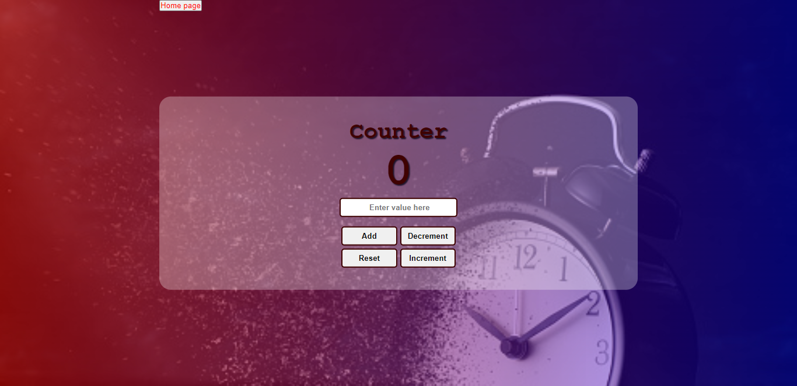

## Table of contents

- [Overview](#overview)
  - [Screenshot](#screenshot)
  - [Links](#links)
  - [Built with](#built-with)
  - [Useful resources](#useful-resources)
- [Author](#author)

## Overview

my 3rd semester AltSchool Exam- vue counter Application

### Screenshot

### Links

- Solution URL: [Add solution URL here](https://github.com/hebrohim/myAltSchoolVueExam)
- Live Site URL: [Add live site URL here](https://my-alt-school-vue-exam.vercel.app/)

### Built with

- vue
- HTML5
-CSS

### Useful resources

- [vue docs](https://devdocs.io/vue~3/) - 

 
## Author

- Website -(https://github.com/hebrohim)

